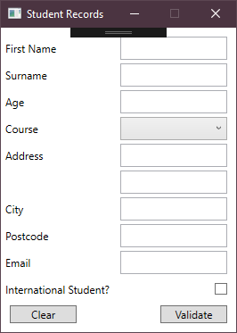
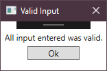

# Coursework 1

This project involved the creation of a simple WPF form to take inputs for a system holding student records. 
It's main purpose was to show ability to use basic WPF fields, and to verify the validity of data entered by the user.

The behaviour of the program is to provide a 'Clear' and 'Validate' button, with the former reverting all fields to their default parameters, and the latter performing the validation.
If an error is found in a any field, a popup window is opened informing the user of the field with the error. If no error is found, a similar popup is opened confirming no errors.

Below are screenshots of the main form and a popup window example:

 
