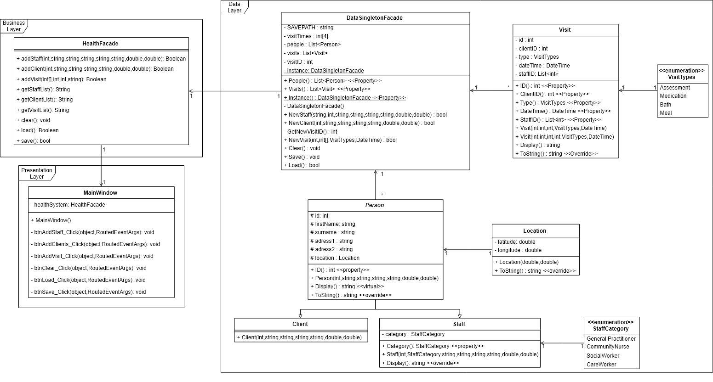

# Coursework 2

This project involved the creation of a multilayered program to contain staff, client and visit data for a proposed health board providing at-home services to elderly patients.
This includes a presentation layer, using a placeholder form to perform test actions for the program; a business layer, containing functions to be accessed by the presentaion layer; 
and a data layer, which holds the majority of the programs functionality.

Below is a class diagram showing the programs structure:

For a more in depth description of this program, please visit joseph-mitchell.github.io/projects/ObjectOrientedSoftwareDevelopment
